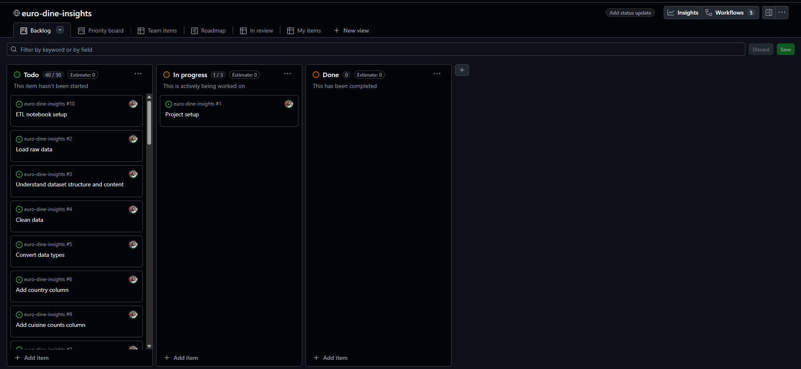
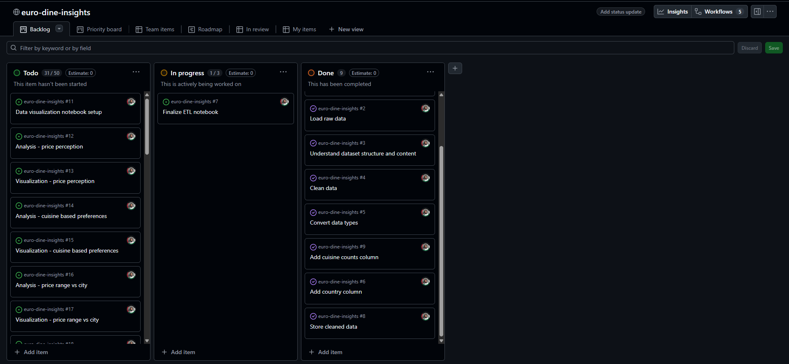
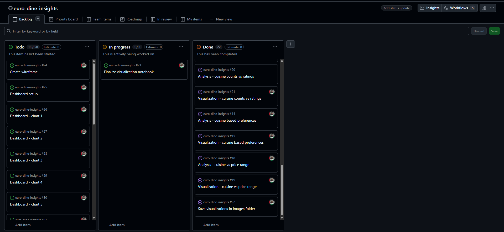
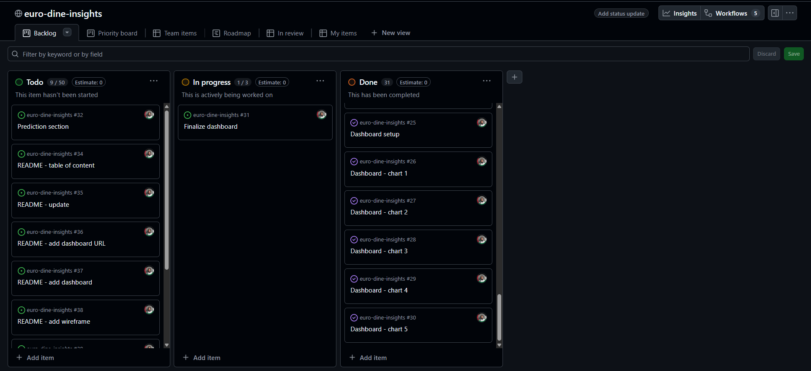

# Kanban Screenshot 1

- This screenshot was taken at the beginning of the project.
   

# Kanban Screenshot 2

- This screenshot was taken at the end of data ETL process
   

# Kanban Screenshot 3

- This screenshot was taken at the end of visualization process
   

# Kanban Screenshot 4

- This screenshot was taken at the end of dashboard process
   

