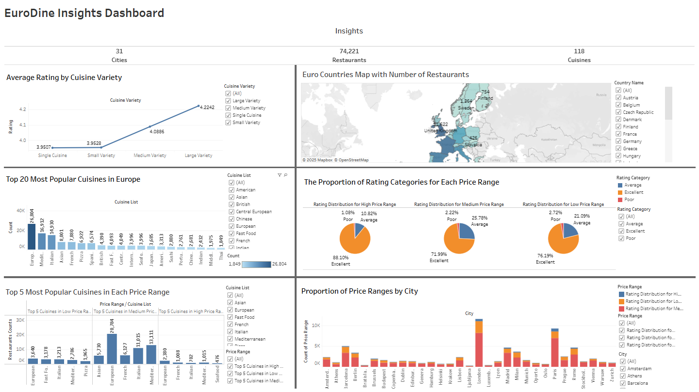
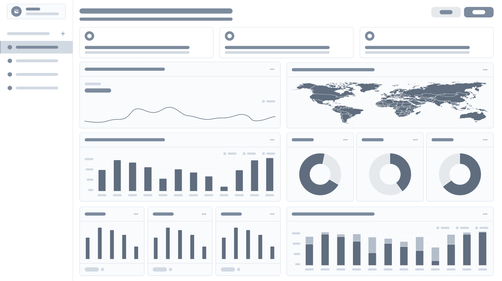

# **EuroDine Insights**

**EuroDine Insights** is a data analysis project based on the [TripAdvisor Restaurants Info for 31 Euro-Cities Dataset](https://www.kaggle.com/datasets/damienbeneschi/krakow-ta-restaurans-data-raw/data)
, featuring over 125,000 restaurants across 31 European cities. Using Python-based analytical and visualization tools, the project explores customer ratings, cuisine preferences, and regional dining trends, through statistical testing.

## Table of Contents

  
Click here to expand the contents

1. [Table of Contents](#TableofContents)
2. [Project Outcomes and Key Findings](#ProjectOutcomesandKeyFindings)
3. [Dataset Content](#DatasetContent)
4. [Business Requirements](#BusinessRequirements)
5. [Hypothesis and Validation](#HypothesisandValidation)
6. [Project Plan](#ProjectPlan)
7. [The Rationale to Map the Business Requirements to the Data Visualizations](#TheRationaletoMaptheBusinessRequirementstotheDataVisualizations)
8. [Analysis Techniques Used](#AnalysisTechniquesUsed)
9. [Ethical Considerations](#EthicalConsiderations)
10. [Dashboard Design](#DashboardDesign)
11. [Wireframe](#Wireframe)
12. [Kanban Board](#KanbanBoard)
13. [Unfixed Bugs](#UnfixedBugs)
14. [Development Roadmap](#DevelopmentRoadmap)
15. [Tableau Deployment](#TableauDeployment)
16. [Main Data Analysis Libraries](#MainDataAnalysisLibraries)
17. [Credits](#Credits)
18. [Acknowledgements](#Acknowledgements)

## 2. Project Outcomes and Key Findings

- Higher price ranges are clearly linked to better ratings, suggesting that diners associate higher prices with better experiences.

- Price distribution varies significantly by city, reflecting local economies: richer cities host more upscale dining, while budget options dominate in more affordable markets.

- There’s a clear positive relationship between cuisine variety and customer ratings, more diverse menus tend to receive better reviews.

- Local culinary traditions shape city-level dining patterns, but niche cuisines achieve standout ratings, indicating strong appreciation for authentic and distinctive food experiences.

- Cuisines naturally segment by price, reflecting ingredients, preparation complexity, and dining experience, from affordable fast food to premium French and Seafood dining.

## 3. Dataset Content

- [TripAdvisor Restaurants Info for 31 Euro-Cities Dataset](https://www.kaggle.com/datasets/damienbeneschi/krakow-ta-restaurans-data-raw/data)

* The dataset contain restaurants information for 31 cities in Europe: Amsterdam (NL), Athens (GR) , Barcelona (ES) , Berlin (DE), Bratislava (SK), Bruxelles (BE), Budapest (HU), Copenhagen (DK), Dublin (IE), Edinburgh (UK), Geneva (CH), Helsinki (FI), Hamburg (DE), Krakow (PL), Lisbon (PT), Ljubljana (SI), London (UK), Luxembourg (LU), Madrid (ES), Lyon (FR), Milan (IT), Munich (DE), Oporto (PT), Oslo (NO), Paris (FR), Prague (CZ), Rome (IT), Stockholm (SE), Vienna (AT), Warsaw (PL), Zurich (CH).

* The data is a .csv file comma-separated that contains 125 433 entries (restaurants). It is structured as follow:

| Column                | Description                                                                                                             |
| --------------------- | ----------------------------------------------------------------------------------------------------------------------- |
| **Name**              | Name of the restaurant                                                                                                  |
| **City**              | City where the restaurant is located                                                                                    |
| **Cuisine Style**     | Cuisine style(s) of the restaurant, stored as a Python list                                                             |
| **Ranking**           | Rank of the restaurant among all restaurants in the city (float)                                                        |
| **Rating**            | Customer rating of the restaurant on a scale from 1 to 5 (float)                                                        |
| **Price Range**       | Price category of the restaurant among 3 categories (categorical)                                                       |
| **Number of Reviews** | Total number of customer reviews (float)                                                                                |
| **Reviews**           | Two sample reviews with their dates, stored as a list of lists: first list contains reviews, second list contains dates |
| **URL_TA**            | Part of the TripAdvisor URL for the restaurant page, after 'www.tripadvisor.com' (string)                               |
| **ID_TA**             | Unique identifier of the restaurant in the TripAdvisor database (one letter + number)                                   |

## 4. Business Requirements

The primary goal of this project is to translate business requirements into actionable insights through intuitive and effective visualizations. Each visualization is designed to directly address specific business questions and support data-driven decision-making:

- **Customer Preferences & Cuisine Ratings**: Identify which cuisines are most favored by customers and whether preferences differ across regions.

- **Price Perception & City Comparison**: Understand how pricing influences customer ratings and how price ranges vary across cities.

- **Cuisine Diversity & Ratings: Requirement**: Explore whether restaurants offering multiple cuisine styles perform better in terms of ratings.

- **Regional Insights & Market Opportunities**: Identify underrepresented or highly-rated niche cuisines to inform market strategy.

## 5. Hypothesis and Validation

1. **Price Perception**

   - Hypothesis: Restaurants with higher prices are more likely to achieve better customer ratings.

   - Variables: Price Range (Low, Medium, High), Rating (Excellent, Average, Poor)

   - Validation Approach: Examine the correlation between rice range and rating using pie charts.

2. **Price Range vs. City**

   - Hypothesis: The the distribution of restaurant price ranges varies across different European cities. Wealthier European cities, such as Geneva and Zurich, have a higher proportion of expensive restaurants compared to cities like Budapest and Krakow.

   - Variables: Price Range, City

   - Validation Approach: Investigates the correlation between price range and city by using stacked bar chart and bar charts.

3. **Cuisine Counts vs. Rating**

   - Hypothesis: Restaurants offering a greater number of cuisines tend to receive higher customer ratings and potentially more reviews due to menu diversity.

   - Variables: Cuisines Counts, Rating

   - Validation Approach: Examine the correlation between cuisine counts and ratings using boxplot, line chart, bar charts and applying statistical testing.

4. **Cuisine-Based Preferences**

   - Hypothesis: Certain cuisines consistently receive higher customer ratings than others due to cultural preferences, dining experiences, and the inherent qualities of the cuisine.

   - Variables: Cuisine List, Rating, City

   - Validation Approach: Compare average ratings across different cuisines using bar charts in various cities and statistical testing.

5. **Cuisine vs. Price Range**

   - Hypothesis: Certain cuisines are associated with specific price ranges, reflecting differences in ingredients, preparation complexity, and dining experience. For example, French and Seafood cuisines are more likely to appear in higher price ranges, while Fast Food or casual cuisines dominate lower price categories.

   - Variables: Cuisine List, Price Range

   - Validation Approach: Analyze the relationship between cuisine type and price range using bar charts visualizations.

## 6. Project Plan

| Phase                                  | Description                                                                                                                                                                                                                                                                 |
| -------------------------------------- | --------------------------------------------------------------------------------------------------------------------------------------------------------------------------------------------------------------------------------------------------------------------------- |
| **1. Research Questions & Hypotheses** | Define the main analytical objectives and relationships to explore, including: • Price perception and city-level variations • City vs. price range • Cuisine diversity and its effect on ratings • Cuisine preferences • Cuisine type vs. price relationship |
| **2. Data Collection**                 | Gather the dataset from [Kaggle](https://www.kaggle.com/datasets/damienbeneschi/krakow-ta-restaurans-data-raw/data)                                                                                                                                                         |
| **3. Data Cleaning & Preprocessing**   | • Handle missing values • Standardize cuisine names • Change/convert data types • Remove duplicates • Add new derived columns • Drop unused columns • Save the cleaned dataset as a new CSV file                                                          |
| **4. Exploratory Data Analysis (EDA)** | • Visualize key variable distributions • Identify trends, patterns, and outliers • Perform hypothesis testing (e.g., ANOVA, Tukey’s HSD) to validate findings                                                                                                         |
| **5. Dashboard Development**           | • Design a wireframe for an interactive dashboard • Develop the dashboard in **Tableau** • Display key metrics and visualizations aligned with research hypotheses                                                                                                    |
| **6. Key Insights & Conclusion**       | • Summarize main findings and observed patterns • Highlight cultural and regional dining preferences • Provide recommendations for improving restaurant strategies and market insights                                                                                |

## 7. The Rationale to Map the Business Requirements to the Data Visualizations

| **Business Requirement**                     | **Rationale**                                                                                                                                                                     | **Data Visualization(s)**                                                                                     |
| -------------------------------------------- | --------------------------------------------------------------------------------------------------------------------------------------------------------------------------------- | ------------------------------------------------------------------------------------------------------------- |
| **Customer Preferences & Cuisine Ratings**   | Identify which cuisines receive the highest ratings and whether preferences vary across European cities. This helps businesses understand cultural preferences and target demand. | Bar charts comparing average ratings by cuisine type across cities; ANOVA tests to detect rating differences. |
| **Price Perception & City Comparison**       | Examine how pricing impacts customer ratings and how price categories are distributed across different cities, revealing economic patterns and customer expectations.             | Pie charts for price vs rating distribution; Stacked bar charts for price range distribution per city.        |
| **Cuisine Diversity & Ratings**              | Explore whether offering multiple cuisines leads to higher customer ratings and more reviews, providing strategic insight for menu diversification.                               | Boxplots and line charts showing cuisine counts vs ratings; ANOVA to test differences between groups.         |
| **Regional Insights & Market Opportunities** | Detect underrepresented but high-rated cuisines to identify untapped opportunities and guide market positioning strategies.                                                       | Bar charts of cuisine prevalence vs average ratings; City-level cuisine distribution maps and rankings.       |

## 8. Analysis Techniques Used

This project applied a combination of exploratory data analysis (EDA), statistical testing, and data visualization to uncover insights from the [TripAdvisor Restaurants dataset](https://www.kaggle.com/datasets/damienbeneschi/krakow-ta-restaurans-data-raw/data). The analytical approach was structured to progressively address each business requirement through targeted techniques.

- **Methods**

  - EDA: Data cleaning, profiling, and transformation (e.g., exploding cuisine lists, standardizing price categories).

  - Visualization: Bar charts, stacked bar charts, pie charts, boxplots, and line charts to explore patterns in price, cuisine, and ratings.

  - Statistical Testing: ANOVA to test differences in ratings across cuisine types and cuisine variety groups.

- **Limitations & Alternatives**

  - Uneven data distribution across cuisines and cities → Focused on top cuisines.

  - Categorical price data limited regression → Used visual and proportional analysis.

  - No temporal data → Focused on cross-sectional insights.

- **Structuring the Analysis**

  - Analysis followed business hypotheses, moving from city-level trends to price vs. rating, cuisine diversity, cuisine preferences, and cuisine–price positioning.

- **AI tools supported**

  - Ideation of hypotheses and business questions

  - Code optimization for data wrangling and statistical tests

- **Core Statistical Concepts & Tests**

  The following statistical concepts and tests were fundamental to the analytical approach:

  - Descriptive Statistics: summarize and describe the main features of a dataset. In this project, measures such as counts, proportions, and averages were used to understand the distribution of cuisines, price categories, and ratings. This provided the foundation for identifying patterns before applying more formal tests.

  - ANOVA (Analysis of Variance): is a statistical test used to determine whether there are significant differences between the means of three or more independent groups. In this project, one-way ANOVA was applied to examine whether average ratings differed significantly across different cuisine types and cuisine variety groups.

  - Null Hypothesis (H₀): There is no difference in the mean ratings across groups.

  - p-value: is the probability of observing the test results (or more extreme) under the assumption that the null hypothesis is true. A p-value < 0.05 is typically considered statistically significant, suggesting that the observed differences are unlikely to have occurred by chance. p-values were used to interpret the significance of results from both ANOVA and t-tests.

  - t-test: is used to compare the means of two independent groups to determine if they are significantly different.

  - Grouping & Proportional Analysis: involve aggregating data by categories (e.g., city, price range, cuisine) and calculating their relative proportions. This approach was particularly useful for categorical variables, such as price ranges, where traditional regression methods were not suitable.

## 9. Ethical Considerations

- The dataset came from Kaggle and do not have any legal or societal issues. There was no personal data within the dataset which could expose or identify anything personal to a particular individual.

## 10. Dashboard Design

The layout follows a top-down storytelling structure, which helps users grasp complex insights quickly while maintaining the option to explore deeper through filters and interactions. The dashboard was designed using Tableau after creating and refining an initial wireframe, which guided the placement of visual elements and ensured a clear, consistent flow of information throughout the final design.

The full interactive Tableau dashboard can be found [here](https://public.tableau.com/authoring/EuroDineInsightsDashboard/EuroDineInsightsDashboard#1), to explore all insights and visualizations in detail.

| #   | Page                                                         | Content Description                                                                                                  | Visualization Type | Key Filters                  | Page Link                                                                                                                        |
| --- | ------------------------------------------------------------ | -------------------------------------------------------------------------------------------------------------------- | ------------------ | ---------------------------- | -------------------------------------------------------------------------------------------------------------------------------- |
| 1   | **Header Section**                                           | Displays overall KPIs: total number of cities, restaurants, and cuisines. Sets the context for the entire dashboard. | KPI Cards / Text   | –                            | [View Page](https://public.tableau.com/authoring/EuroDineInsightsDashboard/Insights#1)                                           |
| 2   | **The Proportion of Rating Categories for Each Price Range** | Compares Excellent, Average, and Poor ratings across High, Medium, and Low price ranges.                             | Pie Charts (x3)    | Rating Category, Price Range | [View Page](https://public.tableau.com/authoring/EuroDineInsightsDashboard/1_TheProportionofRatingCategoriesforEachPriceRange#1) |
| 3   | **Proportion of Price Ranges by City**                       | Compares how different price categories are distributed across major cities.                                         | Stacked Bar Chart  | City, Price Range            | [View Page](https://public.tableau.com/authoring/EuroDineInsightsDashboard/2_ProportionofPriceRangesbyCity#1)                    |
| 4   | **Average Rating by Cuisine Variety**                        | Shows how restaurant ratings change based on the number of cuisines offered (Single → Large Variety).                | Line Chart         | Cuisine Variety              | [View Page](https://public.tableau.com/authoring/EuroDineInsightsDashboard/3_AverageRatingbyCuisineVariety#1)                    |
| 5   | **Most Popular Cuisine in Each City**                        | Shows the most popular cuisines in each city.                                                                        | Bar Charts         | Cuisine List, City           | [View Page](https://public.tableau.com/authoring/EuroDineInsightsDashboard/4_MostPopularCuisineinEachCity#1)                     |
| 6   | **Top 20 Most Popular Cuisines in Europe**                   | Displays the most common cuisines based on restaurant count.                                                         | Bar Chart          | Cuisine List                 | [View Page](https://public.tableau.com/authoring/EuroDineInsightsDashboard/4_Top20MostPopularCuisinesinEurope#1)                 |
| 7   | **Top 5 Most Popular Cuisines in Each Price Range**          | Shows the most popular cuisines segmented by price range.                                                            | Bar Charts (x3)    | Cuisine List, Price Range    | [View Page](https://public.tableau.com/authoring/EuroDineInsightsDashboard/5_Top5MostPopularCuisinesinEachPriceRange#1)          |
| 8   | **Euro Countries Map with Number of Restaurants**            | Highlights restaurant distribution across European countries.                                                        | Map                | Country Name                 | [View Page](https://public.tableau.com/authoring/EuroDineInsightsDashboard/EuroCountriesMapwithNumberofRestaurants#1)            |
| 9   | **Dashboard**                                                | Provides a complete overview of all KPIs, trends, and insights from all the sheets.                                  | All Charts         | All Filters                  | [View Page](https://public.tableau.com/authoring/EuroDineInsightsDashboard/EuroDineInsightsDashboard#1)                          |

- **Design Approach**

  - High-level overview → Key KPIs and map

  - Key hypotheses → Cuisine variety ratings, price–rating patterns, cuisine popularity

  - Detailed breakdown → Cuisine–price relationships and city-level price range proportions

- **Communication of Insights**

  - The dashboard is designed for both technical and non-technical audiences.

  - Non-technical users: Can explore key patterns using interactive filters and intuitive visuals (pie charts, bar charts, maps).

  - KPI cards and clean labeling provide instant understanding of scale and distribution.

  - Technical users: Can drill down into cuisine categories, price ranges, and city-level distributions for deeper analysis.

## 11. Wireframe

The wireframe layout for EuroDine Insights Project was created using Figma to plan the structure and organization of key visual elements. It outlines where charts, maps, and summary cards will be placed, helping to ensure a clear and logical flow of information. This stage focuses on layout and functionality rather than design details, allowing for easy adjustments before building the actual dashboard.

## 12. Kanban Board

- The kanban board screenshots can be found [here](KANBAN.md)
- The project board can viewed [here](https://github.com/users/RanaAlaaTahon/projects/3/views/1)

## 13. Unfixed Bugs

No unfixed bugs were identified across the ETL, visualization notebook, or dashboard components. All features are functioning as intended, and the project delivers the expected analytical insights and interactive experience.

While there were no technical bugs left unresolved, I encountered some challenges while working with Tableau due to my limited experience with the tool. These were mainly related to layout adjustments and dashboard structuring rather than functional errors. Through trial, documentation review, and experimentation, I was able to resolve these issues and complete the dashboard.

Moving forward, I plan to continue improving my Tableau skills to work more efficiently and make use of more advanced features in future projects.

## 14. Development Roadmap

The EuroDine Insights project followed a structured development roadmap to transform raw data into actionable insights and a fully interactive Tableau dashboard. Below is a visual overview of the key phases, challenges, and strategies:

| Phase                      | Key Highlights                                                                                      | Challenges & Solutions                                                                                          |
| -------------------------- | --------------------------------------------------------------------------------------------------- | --------------------------------------------------------------------------------------------------------------- |
| **Research & Hypotheses**  | Defined clear business questions and formulated testable hypotheses based on dataset variables.     | Ensuring hypotheses were actionable with available data → Iteratively refined through initial data exploration. |
| **Data Collection**        | Gathered and examined the 31-city TripAdvisor dataset.                                              | Nested fields and large file size → Used `pandas explode()` and normalization techniques to structure the data. |
| **Data Cleaning**          | Standardized cuisine names, handled missing values, derived new columns, and removed duplicates.    | Dealt with inconsistent data through mapping tables, string cleaning, and imputation rules.                     |
| **EDA**                    | Performed descriptive analysis, visualized distributions, and conducted ANOVA test.                 | Managed uneven data distribution by focusing on top cuisines and grouping categories for clearer comparisons.   |
| **Visualization Notebook** | Created key visualizations for cuisine popularity, ratings, pricing trends, and city comparisons.   | Simplified charts and applied consistent labeling to ensure readability and performance with large datasets.    |
| **Dashboard Development**  | Designed the wireframe in Figma and implemented the Tableau dashboard with KPIs, maps, and filters. | Overcame layout and performance issues through extract optimization and careful placement of visual elements.   |
| **Review & Refinement**    | Conducted self-review to refine labeling, layout, and logical flow of dashboard pages.              | Improved navigation and communication of insights by restructuring page order and enhancing clarity.            |

**Future Learning & Next Steps**

Based on this project experience, the following areas have been identified for further development:

- Advanced Tableau Features: Dynamic dashboards, parameter controls, and enhanced tooltips.

- ETL Optimization: Explore frameworks like Spark or Dask for scaling data processing.

- Web-Based Visualization: Build dashboards Streamlit for more customization.

- Predictive Analytics: Apply clustering or recommendation algorithms to derive future-oriented insights.

- Data Storytelling: Further refine the ability to present insights to both technical and non-technical audiences.

## 15. Tableau Deployment

The interactive dashboard for EuroDine Insights was developed and deployed using Tableau Public. The deployment process involved publishing the final dashboard to Tableau’s cloud platform, making it accessible through a shareable public link.

**Steps for Deployment**

1.  Dashboard Finalization

    - All visualizations were designed and refined in Tableau Desktop.

    - Filters, parameters, and interactions were tested to ensure a smooth user experience.

    - Layouts were optimized for viewing on desktop browsers.

2.  Publishing to Tableau Public

    - The completed dashboard was published to Tableau Public

    , a free platform that allows Tableau visualizations to be hosted online.

    - While publishing, the workbook was made publicly accessible to enable sharing and embedding.

3.  Accessing the Dashboard

    - The deployed dashboard can be viewed directly through this [link](https://public.tableau.com/authoring/EuroDineInsightsDashboard/EuroDineInsightsDashboard#1)

    - No additional installations are required, the dashboard runs directly in the browser.

- **Future Improvements**

  - Optimize the dashboard for mobile responsiveness to improve accessibility on smaller screens.

  - Implement regular dataset refreshes to keep the dashboard up to date.

## 16. Main Data Analysis Libraries

- Pandas
- NumPy
- Matplotlib
- Seaborn
- Plotly
- Tableau
- scipy

## 17. Credits

- Kaggle Dataset: [TripAdvisor Restaurants Info for 31 Euro-Cities Dataset](https://www.kaggle.com/datasets/damienbeneschi/krakow-ta-restaurans-data-raw/data)
- Generative AI tools: ChatGPT, GitHub Copilot
- YouTube
- [Hackathon 1](https://github.com/stephenbeese/Online-Retail-Analysis)

## 18. Acknowledgements
